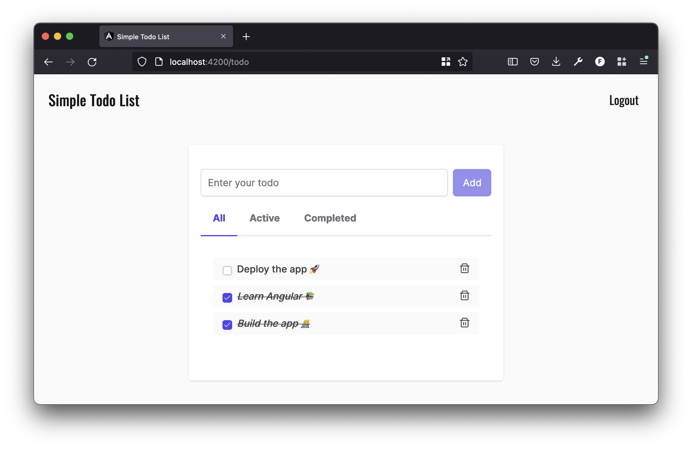

  <h3 align="center">Simple Todo List</h3>
  

    A simple todo list running with Angular, NgRx and Firebase.
  

  
Table of Contents

  <ol>
    <li href="#about-the-project">About The Project</li>
    <ul>
      <li><a href="#built-with">Built With</a></li>
    </ul>
  </ol>

## About The Project

This is a simple todo list running by Angular, NgRx and Firebase.

You can:

- Sign Up an account and Login
- Create your todos
- Mark your todos as finished
- Delete your todos

## Built with

- [Angular](https://www.angular.io)
- [NgRx](https://ngrx.io/)
- [Firebase](https://firebase.google.com/)
- [AngularFire](https://github.com/angular/angularfire)
- [PrimeNG](https://www.primefaces.org/primeng/)
